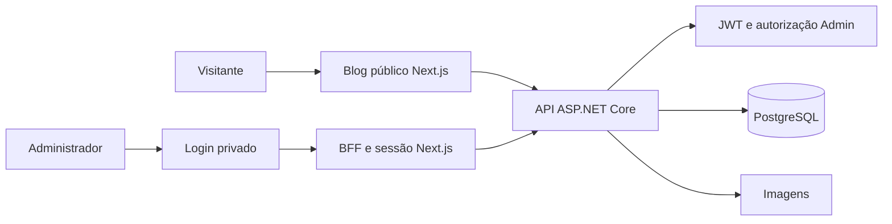

# Guia de implementação do Blog no frontend

## 1. Objetivo

Implementar no portfólio Next.js duas áreas independentes:

- **Blog público:** artigos publicados, busca, paginação, categorias, tags e SEO.
- **Painel editorial privado:** login e gerenciamento de posts, categorias, tags e imagens.

O painel não deve ser anunciado nem renderizado na interface pública. Porém, esconder o link ou usar uma URL difícil não é segurança: mesmo que a rota seja descoberta, autenticação e autorização devem impedir o acesso aos dados e às operações.

## 2. Arquitetura



O Next.js deve atuar como BFF na área administrativa. O navegador envia um cookie de sessão protegido ao servidor Next.js, que valida a sessão e conversa com a API. O JWT não deve ficar disponível ao JavaScript do navegador. O backend permanece como autoridade final e protege todos os endpoints privados.

## 3. Estrutura sugerida

```text
src/
├── app/
│   ├── (site)/blog/
│   │   ├── page.tsx
│   │   ├── loading.tsx
│   │   ├── error.tsx
│   │   ├── [slug]/page.tsx
│   │   ├── categoria/[slug]/page.tsx
│   │   └── tag/[slug]/page.tsx
│   ├── (admin)/_control/
│   │   ├── login/page.tsx
│   │   └── painel/
│   │       ├── layout.tsx
│   │       ├── page.tsx
│   │       ├── posts/
│   │       ├── categorias/
│   │       ├── tags/
│   │       └── imagens/
│   ├── api/admin-session/
│   │   ├── login/route.ts
│   │   ├── logout/route.ts
│   │   └── refresh/route.ts
│   ├── robots.ts
│   └── sitemap.ts
├── components/{blog,admin}/
├── features/{blog,admin}/
├── lib/
│   ├── api/{public-blog,admin-blog.server}.ts
│   └── auth/{session.server,authorization.server}.ts
├── types/blog.ts
└── proxy.ts
```

Os route groups `(site)` e `(admin)` separam layouts e código sem entrar na URL. `/_control` diminui divulgação acidental, mas não é proteção. Arquivos de sessão e API privada devem usar `server-only`.

## 4. Contratos e dados

Validar os caminhos no Swagger antes de implementar. O frontend público precisará, conceitualmente, de:

- `GET /posts` com página, tamanho, busca, categoria e tag;
- `GET /posts/{slug}`;
- `GET /categories` e posts por categoria;
- `GET /tags` e posts por tag.

O painel precisará de login e das operações privadas de posts, categorias, tags e imagens.

Um post possui **várias categorias**. Tipos, cards, filtros e formulários devem tratar `categories` como coleção:

```ts
type Taxonomy = { id: string; name: string; slug: string }

type PostSummary = {
  id: string
  title: string
  slug: string
  excerpt: string
  coverImageUrl: string | null
  publishedAt: string
  readingTimeMinutes: number
  categories: Taxonomy[]
  tags: Taxonomy[]
}
```

## 5. Blog público

### `/blog`

- usar Server Component para a carga inicial;
- mostrar apenas posts publicados;
- renderizar capa, resumo, data, tempo de leitura, categorias e tags;
- oferecer busca e paginação sincronizadas com a URL;
- tratar loading, erro e lista vazia.

### `/blog/[slug]`

- retornar `notFound()` para slug inexistente ou rascunho;
- exibir artigo, capa, datas, categorias, tags e relacionados;
- sanitizar HTML antes de renderizá-lo;
- adicionar compartilhamento por URL e navegação acessível;
- gerar metadata específica no servidor.

### Categorias e tags

- `/blog/categoria/[slug]` lista posts associados à categoria;
- `/blog/tag/[slug]` lista posts associados à tag;
- filtros e paginação ficam na query string;
- múltiplas categorias não devem gerar páginas duplicadas sem canonical.

## 6. SEO

- implementar `generateMetadata`, canonical e Open Graph por artigo;
- incluir JSON-LD `BlogPosting`;
- gerar sitemap e RSS apenas com conteúdo publicado;
- manter slugs estáveis e redirects quando forem alterados;
- escolher uma única fonte para o sitemap, evitando duplicidade entre frontend e API.

Todas as páginas administrativas devem usar:

```ts
export const metadata = {
  robots: { index: false, follow: false, nocache: true },
}
```

Excluir painel, login, preview e endpoints internos do `sitemap.ts`. O `robots.ts` pode desestimular rastreamento, mas não protege nada e ainda é publicamente visível.

## 7. Como manter o painel fora da página pública

- não adicionar links no navbar, footer, home, busca ou constantes públicas de navegação;
- não publicar sua URL em sitemap, RSS, JSON-LD ou metadata;
- usar layout administrativo separado, sem navbar e footer públicos;
- não importar componentes administrativos em páginas públicas;
- aplicar `noindex, nofollow` e `Cache-Control: private, no-store`;
- nunca usar `NEXT_PUBLIC_*` para segredo, token, senha ou URL interna sensível;
- nunca guardar JWT em `localStorage` ou `sessionStorage`.

Essas medidas reduzem exposição, mas a inacessibilidade depende das proteções abaixo.

## 8. Autenticação e autorização

### Login e cookie

1. O formulário envia credenciais a um Route Handler ou Server Action do Next.js.
2. O servidor encaminha as credenciais à API.
3. Após sucesso, cria cookie `HttpOnly`, `Secure` em produção e `SameSite` adequado.
4. O administrador é redirecionado ao painel.
5. O erro de login permanece genérico para não revelar usuários existentes.

### Proxy do Next.js 16

Criar `src/proxy.ts` para uma checagem inicial:

```ts
export const config = {
  matcher: ['/_control/painel/:path*'],
}
```

O Proxy serve apenas para redirecionamento otimista. Ele não substitui autorização no acesso aos dados.

### Verificação obrigatória

Criar uma função central `requireAdmin()` que valide sessão, expiração, revogação e função administrativa no servidor. Chamá-la em:

- cada página privada;
- cada Server Action;
- cada Route Handler privado;
- cada função de acesso à API administrativa.

Não proteger somente o layout. Toda operação também deve ser validada pelo ASP.NET Core, retornando `401` sem autenticação e `403` sem permissão. Nunca confiar em role ou ID enviados pelo cliente.

No logout, invalidar a sessão, apagar o cookie e redirecionar ao login. Caso exista refresh token, ele também deve permanecer inacessível ao JavaScript.

## 9. Telas administrativas

- **Login:** e-mail, senha, validação, erro seguro e rate limit no backend.
- **Dashboard:** totais de publicados e rascunhos, recentes e atalhos.
- **Posts:** busca, filtros, criação, edição, publicação e exclusão.
- **Editor:** rich text, código, imagens, quotes, tabelas, links, preview e autosave.
- **Categorias:** CRUD e validação de slug.
- **Tags:** CRUD e validação de slug.
- **Imagens:** upload, texto alternativo, limite e tipos permitidos.
- **Configurações:** somente opções realmente suportadas pela API.

O formulário de post deve fornecer seleção múltipla de categorias e enviar uma coleção de IDs. O backend deve revalidar existência, duplicidade e regras de integridade.

## 10. Variáveis de ambiente

```env
API_BASE_URL=http://localhost:5000
NEXT_PUBLIC_SITE_URL=http://localhost:3000
```

`API_BASE_URL` fica no servidor quando apontar para rede interna. Segredos nunca devem ser versionados nem usar o prefixo `NEXT_PUBLIC_`.

## 11. Roadmap exato

### Etapa 1 — Fundação

- [ ] Conferir Swagger e DTOs reais.
- [ ] Criar tipos de post, categoria, tag, imagem e paginação.
- [ ] Confirmar coleção de categorias de ponta a ponta.
- [ ] Criar clientes separados para API pública e privada.
- [ ] Configurar URLs por ambiente.

Dependência: API disponível.

### Etapa 2 — Blog público

- [ ] Implementar `/blog` com busca e paginação.
- [ ] Implementar `/blog/[slug]`.
- [ ] Implementar páginas de categoria e tag.
- [ ] Adicionar loading, erro, vazio e `404`.
- [ ] Adicionar tempo de leitura, relacionados e compartilhamento.

Dependência: Etapa 1.

### Etapa 3 — SEO

- [ ] Adicionar metadata, canonical, Open Graph e JSON-LD.
- [ ] Atualizar sitemap apenas com URLs públicas.
- [ ] Implementar RSS apenas com posts publicados.
- [ ] Confirmar ausência de qualquer URL administrativa.

Dependência: Etapa 2.

### Etapa 4 — Sessão privada

- [ ] Implementar login pelo servidor Next.js.
- [ ] Criar cookie protegido.
- [ ] Criar `requireAdmin()`.
- [ ] Criar `src/proxy.ts` como primeira barreira.
- [ ] Implementar logout, expiração e eventual refresh.
- [ ] Aplicar layout separado, `noindex` e `no-store`.

Dependência: autenticação na API.

### Etapa 5 — Painel

- [ ] Criar dashboard.
- [ ] Criar lista e filtros de posts.
- [ ] Criar formulário com múltiplas categorias.
- [ ] Integrar editor, preview e autosave.
- [ ] Criar telas de categorias, tags e imagens.
- [ ] Tratar `401`, `403`, conflitos e validações.

Dependência: Etapa 4.

### Etapa 6 — Verificação

- [ ] Testar acesso direto às rotas privadas como visitante.
- [ ] Testar cookie ausente, inválido e expirado.
- [ ] Testar usuário autenticado sem permissão Admin.
- [ ] Testar criação e edição com várias categorias.
- [ ] Confirmar ausência do painel em HTML, links e bundles públicos.
- [ ] Confirmar ausência no sitemap, RSS e busca.
- [ ] Executar lint, build e testes automatizados.
- [ ] Validar responsividade, acessibilidade e SEO.

## 12. Casos de teste de segurança

| Cenário | Resultado esperado |
|---|---|
| Visitante abre a URL do painel | Redirecionado ao login, sem dados privados |
| Visitante chama endpoint privado | `401 Unauthorized` |
| Usuário sem função Admin chama endpoint privado | `403 Forbidden` |
| JWT expirado ou adulterado | Sessão rejeitada |
| Robô consulta sitemap ou RSS | Nenhuma URL administrativa |
| Página pública é inspecionada | Nenhum token, segredo ou componente admin |
| Rascunho é solicitado publicamente | `404` ou resposta sem conteúdo |
| IDs ou categorias são adulterados | Backend revalida autorização e dados |

## 13. Checklist final

- [ ] Blog público funcional em desktop e mobile.
- [ ] Somente posts publicados aparecem publicamente.
- [ ] Posts suportam várias categorias em todas as camadas.
- [ ] Conteúdo do editor é sanitizado.
- [ ] SEO, sitemap, RSS e dados estruturados validados.
- [ ] Painel ausente do menu, rodapé, home, busca, sitemap e RSS.
- [ ] Código administrativo isolado do layout e bundles públicos.
- [ ] Cookie protegido e token ausente do armazenamento do navegador.
- [ ] Todas as operações privadas protegidas no Next.js e ASP.NET Core.
- [ ] Rotas privadas usam `noindex` e respostas usam `no-store`.
- [ ] Testes anônimo, role incorreta e sessão expirada aprovados.
- [ ] Nenhum segredo presente no repositório ou variáveis públicas.

O painel só deve ser considerado seguro quando estiver simultaneamente ausente da navegação pública e inacessível a usuários sem autorização, mesmo por acesso direto à URL ou à API.
